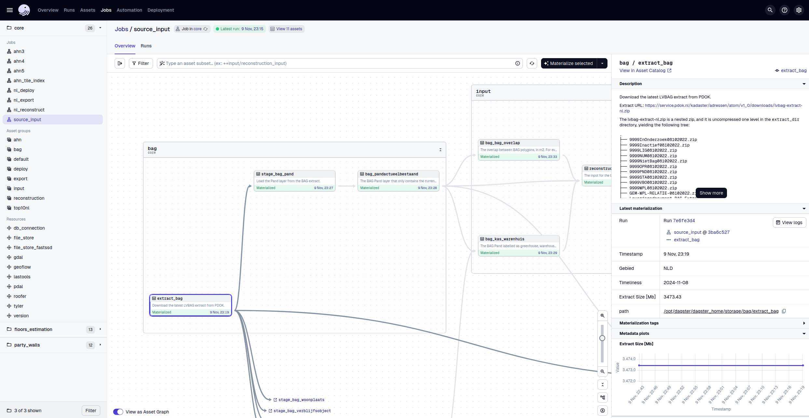

# 3DBAG pipeline

This is the repository of the 3DBAG production pipeline, shortly known as `3dbag-pipeline`.
The `3dbag-pipeline` orchestrates the various steps in order to produce and serve the 3DBAG data.
Namely:

- source data ingestion and preprocessing,
- input data preparation, such as tiling,
- building reconstruction,
- postprocessing, such as validation, format conversion and tiling,
- data deployment.

The `3dbag-pipeline` is built with the [Dagster](https://dagster.io) data orchestration tool, therefore some familiarity with Dagster is recommended.

*Screenshot of the 3dbag-pipeline in the dagster UI.*

The 3dbag-pipeline is written in Python, because Dagster is a Python framework, however, almost all data processing is done by external tools.

## Documentation

You will find the complete documentation at [https://innovation.3dbag.nl/3dbag-pipeline](https://innovation.3dbag.nl/3dbag-pipeline).

## Project layout

The 3dbag-pipeline is organized into several packages.
The packages are organized into a `common` package and a number of workflow packages.
The `common` package contains the resources, functions and type definitions that are used by the 3DBAG packages that define the data processing workflows.
The workflow packages contain the assets, jobs, sensors etc. that define a data processing workflow for a part of the complete 3DBAG.

The reason for this package organization is that workflow packages have widely different dependencies, and installing them into the same environment bound to lead to dependency conflicts.
Additionally, this organization makes it easier to install and test the workflow packages in isolation.

- [`common`](index_common.md): The common package used by the workflow packages.
- [`core`](index_core.md): Workflow for producing the core of the 3D BAG data set.
- [`party_walls`](index_party_walls.md): Workflow for calculating the party walls.
- [`floors-estimation`](index_floors_estimation.md): Workflow for estimating the number of floors.

## Deployment

Deploying the 3dbag-pipeline is complex, because of its many components and dependencies.
You can read about the details on how can you deploy it in the [deployment section](deployment/index.md).

## Production

## License

Licensed under either of

 * Apache License, Version 2.0 ([LICENSE-APACHE](LICENSE-APACHE) or http://www.apache.org/licenses/LICENSE-2.0)
 * MIT license ([LICENSE-MIT](LICENSE-MIT) or http://opensource.org/licenses/MIT)

at your option.

## Contribution

Unless you explicitly state otherwise, any contribution intentionally submitted
for inclusion in the work by you, as defined in the Apache-2.0 license, shall be dual licensed as above, without any
additional terms or conditions.

## 3DBAG organisation

This software is part of the 3DBAG project. For more information visit the [3DBAG organisation](https://github.com/3DBAG).
