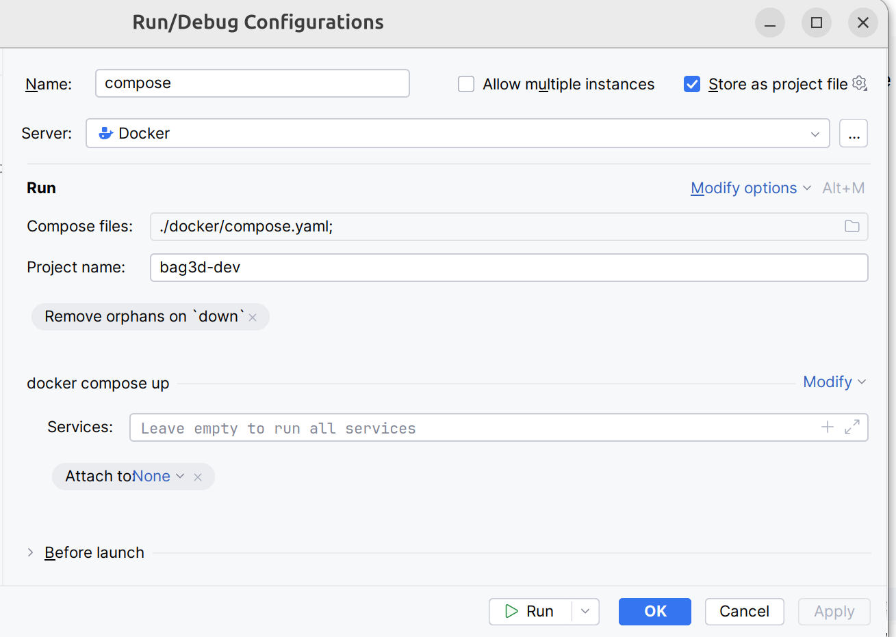
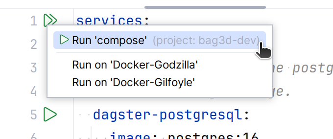
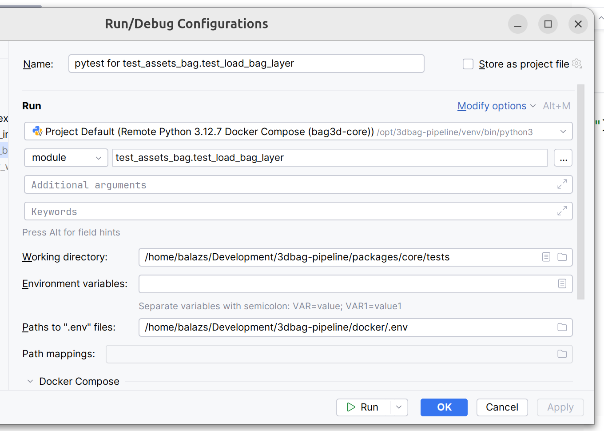

# Code

Thank you for considering contributing to the 3DBAG pipeline. In this document, we will guide you through setting up your local development environment and running the tests. For information on how to submit a contribution, please refer to our [guidelines](guidelines.md).

## Setup

After cloning the repository from [https://github.com/3DBAG/3dbag-pipeline](https://github.com/3DBAG/3dbag-pipeline), the recommended way to set up your environment is with Docker.

Requirements:

- Python >=3.11

- make

- Docker Engine

- Docker Compose (>= 2.22.0)


We use `make` for managing many commands that we use in development.

### Test data & Docker Volumes

The Makefile uses two different .env files for controlling the local environment and the environment in the Docker containers.
The `.env` file in the root directory is used for the local environment and the `docker/.env` file is used for the Docker environment.
The values in the root `.env` file are specific to your local environment and you need to set them up yourself.

```shell
echo "BAG3D_TEST_DATA=${PWD}/tests/test_data" > .env
```

Download test data:

```shell
make download
```

Create the docker volumes that store the test data:

```shell
make docker_volume_create
```

In addition, `make docker_volume_rm` removes the volumes, `make docker_volume_recreate` recreates the volumes.

Note that if you change the test data locally and you want the docker services to use the updated data, you need to:

1. stop the services: `make docker_down`

2. recreate the volumes in order to copy the new data into them: `make docker_volume_recreate`

3. start the service again: `make docker_up`

### Docker containers

Start the docker containers with `watch` enabled with the following command:

```shell
make docker_watch
```

The `watch` attribute allows you to synchronize changes in the code with your containers. When you issue this command for the first time, several things happen:

1. The required base images are pulled from DockerHub.

2. The 3dbag-pipeline workflow images are built from the local source code.

3. The containers are connected to the volumes and networks.

4. The dagster-webserver is published on `localhost:3003`.

5. Docker compose starts watching for changes in the source code on the host machine.

The running containers contain all the tools required for a complete run of the 3dbag-pipeline.
This means that you can develop and test any part of the code locally.

If you make a change in the source code in your code editor, the files are automatically synced into the running containers. You can see your changes in effect **after reloading the code location, job, asset or resource** in the Dagster UI on `localhost:3003`.

The docker documentation describes in detail [how the compose watch functionality works](https://docs.docker.com/compose/how-tos/file-watch/).

If you don't want to enable the code synchronization, you can use `make docker_up` command, which starts the containers without without the  `watch` attribute.

The `docker_watch` and `docker_up` targets will set the docker compose project name to `bag3d-dev`.

### Docker setup in PyCharm (professional)

Create run configuration that uses the docker compose file.
For example, see the screenshot below. 


Start the services by running the configuration from the compose file.
For example, see the screenshot below. 


Set up the python interpreter in the docker container as the project interpreter, using PyCharm's docker-compose interpreter setup.
Note here that you need to use the matching service for the 3dbag-pipeline package. 
For example, for working on the `core` package, you need to configure the `bag3d-core` service for the python interpreter.

To run a specific test, set up a run configuration with the python interpreter in docker and make sure to use the environment variables from the `docker/.env` file.


For further details, see the [PyCharm documentation](https://www.jetbrains.com/help/pycharm/using-docker-compose-as-a-remote-interpreter.html#run).

### Code formatting

In you have a local installation of `uv`, you can format you code with:

```
make format
```

###  Tests
Tests are run separately for each package and they are located in the `tests` directory of the package.
Tests use `pytest`.

Some tests take a long time to execute. These are marked with the `@pytest.mark.slow` decorator and they will be skipped by default. In order to include the slow tests in the test execution, use the `--run-slow` command line option.

The tests use the sample data that are downloaded as shown above.

You can run the fast unit test for all packages with:
 
 ```shell
 make test
 ```

For running also the slow tests (which require more time) you can run:

  ```shell
 make test_slow
 ```

 For running the integration tests you can use:

  ```shell
 make test_integration
 ```

 For running all tests, you can run:

 ```shell
 make test_all
 ```

## Installing requirements without the Docker setup

The pipeline has the following requirements:

- Python 3.11

- Docker

- [Tyler](https://github.com/3DGI/tyler)

- [Geoflow-roofer](https://github.com/3DBAG/geoflow-roofer)

- [LAStools](https://github.com/LAStools/LAStools)

- [gdal](https://github.com/OSGeo/gdal)

- [pdal](https://github.com/PDAL/PDAL)

The `build-tools.sh` Bash script can help you to build the required tools. 
See `build-tools.sh --help` for usage instructions.
Note that you need to run `build-tools.sh` with `bash` (not `sh`), and it can take a 
couple of hours to build everything.
Requirements for building the tools:

- C and C++ compilers (min. GCC 13 or Clang 18)
- CMake
- Rust toolchain
- Git
- wget
- libgeos
- sqlite3
- libtiff


## Branches

The `master` branch contains stable versions of the 3dbag-pipeline.
We use the master branch to produce a 3DBAG version. 
After a new 3DBAG is successfully produced, we tag and release the master branch, using the version number of the new 3DBAG, in the form of `<year>.<month>.<day>`, for example `2024.10.24`.

We use production candidate tags in the form of `<year>.<month>-pc<build>`, for example `2024.10-pc0`.
Production candidates are versions on the `develop` branch that are deployed to our production server and tested with a full pipeline run, but with a subset of the input.
If a production candidate is successful then it will be used for producing the final 3DBAG.

Moving the code onto a `production` branch helps the collaboration with external contributors.
When we move a version onto `production`, we freeze that version and won't add any new features, only fixes that are required in the production test.
At the same time, work can continue on the `develop` branch, pull requests can be opened and merged.

The `develop` branch is a trunk where the pull requests from the contributors are merged.
When a pull request is opened, the following checks are performed in GitHub Actions:
- static code analysis,
- formatting conformance,
- unit testing,
- integration testing.
Each check must pass for the pull request in order to be approved.

When a pull request is merged into the develop branch, the following actions are performed in GitHub Actions:
- documentation is built,
- the docker images are built and published on DockerHub with the `develop` tag,
- the `develop` docker images are deployed onto our production server.


## Coding Conventions

SQL files are stored in the `sqlfiles` subpackage, so that the `bag3d.common.utils.database.load_sql` function can load them.

The dependency graph of the 3D BAG packages is strictly `common`<--*workflow packages*, thus workflow packages cannot depend on each other.
If you find that you need to depend on functionality in another workflow package, move that function to `common`.

Docstrings follow the [Google style](https://google.github.io/styleguide/pyguide.html#38-comments-and-docstrings). 
However, *dagster* is too smart for it's own good and if you describe the return value with the `Returns:` section, then *dagster* will only display the text of the `Returns:` section in the dagster UI.
A workaround for this is to include the `Returns:` heading in the return value description.
For example `Returns a collection type, storing the...`

Assets are usually some results of computations, therefore their names are nouns, not verbs.


## Release process

Release always happens from the `master` branch, after merging the successful production candidate branch into `master`.
See the [branches](#branches) section for more information.

1. Update the CHANGELOG.md file with the new version and the changes. It must include the new version number that you are releasing, e.g. `## [2024.10.24]`.
2. On GitHub, create a new pull request from the current production candidate branch to the `master` branch and merge it.
3. Manually trigger the release workflow on GitHub Actions. You'll need to input the new version number that you added to the CHANGELOG, e.g. `2024.10.24`. This will create a new release on GitHub and add the contents of the CHANGELOG to the release notes.


## Dagster

#### Terminate all in the queue

Needs to be executed in the environment where the Dagster UI and the Dagster-daemon are running.
This is currently `/opt/dagster/venv` on gilfoyle.
On gilfoyle, need to source all the environment variables first (`/opt/dagster/dagster_home/.env`).

On gilfyole:

```shell
su dagster
export DAGSTER_HOME=/opt/dagster/dagster_home
source DAGSTER_HOME=/opt/dagster/dagster_home/.env
source /opt/dagster/venv/bin/activate
```

```python
from dagster import DagsterInstance, RunsFilter, DagsterRunStatus

instance = DagsterInstance.get() # needs your DAGSTER_HOME to be set, DAGSTER_HOME=/opt/dagster/dagster_home on gilfoyle

while True:
    queued_runs = instance.get_runs(limit=100, filters=RunsFilter(statuses=[DagsterRunStatus.QUEUED]))
    if not queued_runs:
        break
    for run in queued_runs:
        instance.report_run_canceled(run)
```

#### Schedules and sensors

If you want to enable Dagster [Schedules](https://docs.dagster.io/concepts/partitions-schedules-sensors/schedules) or [Sensors](https://docs.dagster.io/concepts/partitions-schedules-sensors/sensors) for your jobs, start the [Dagster Daemon](https://docs.dagster.io/deployment/dagster-daemon) process in the same folder as your `workspace.yaml` file, but in a different shell or terminal.

The `$DAGSTER_HOME` environment variable must be set to a directory for the daemon to work. Note: using directories within /tmp may cause issues. See [Dagster Instance default local behavior](https://docs.dagster.io/deployment/dagster-instance#default-local-behavior) for more details.

In this repository the `$DAGSTER_HOME` is in `tests/dagster_home`.

```bash
export DAGSTER_HOME=<absolute path to tests/dagster_home>
dagster-daemon run
```

Once your Dagster Daemon is running, you can start turning on schedules and sensors for your jobs.

#### GraphQL API

Dagster has a GraphQL API and it is served alongside the dagster-webserver at `/graphql` (eg `http://localhost:3000/graphql`).
One can do basically everything that is doable in the Dagster UI.
Retrieve data on assets, runs etc., but also launch runs.

This query to get the asset materializations metadata and asset dependencies (lineage):

```
{
  assetNodes(
    group: {
      groupName: "top10nl"
      repositoryName: "__repository__"
      repositoryLocationName: "core_py_311_virtual_env"
    }
    pipeline: {
      pipelineName: "source_input"
      repositoryName: "__repository__"
      repositoryLocationName: "core_py_311_virtual_env"
    }
    # assetKeys: { path: ["top10nl", "stage_top10nl_gebouw"] }
    loadMaterializations: true
  ) {
    assetKey {
      path
    }
    dependencies {
      asset {
        assetKey{path}
      }
    }
    assetMaterializations(limit: 1) {
      runId
      assetLineage {
        assetKey {
          path
        }
        partitions
      }
      metadataEntries {
        label
        description
        __typename
        ... on TextMetadataEntry {
          text
        }
        __typename
        ... on IntMetadataEntry {
          intValue
        }
      }
    }
  }
}
```
